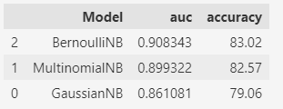
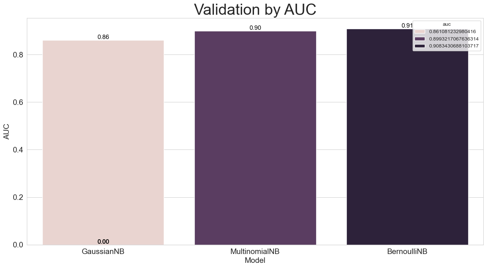

# Sentiment_Analysis_MovieReviewsIMDB
Using probabilistic algorithms to classify sentiment in user reviews of a dataset with 50,000 movie reviews.  Project using natural language processing and supervised learning algorithms.

Dataset: https://www.kaggle.com/datasets/lakshmi25npathi/imdb-dataset-of-50k-movie-reviews

### Pre-processing:
- NLTK.StopWords
- NLTK.Tokenize
- NLTK.Steam
- CountVectorizer

### Model Selection:
- Sklearn: train_test_split

### Model Prediction:
- NaiveBayes: GaussianNB
- NaiveBayes: MultinomialNB
- NaiveBayes: BernoulliNB

### Metrics:
- Accuracy_score
- AUC ROC (roc_auc_score)

### Results:

Best Model:

- Text Indicates Positive Sentiment OR
- Text Indicates Negative Sentiment!.
